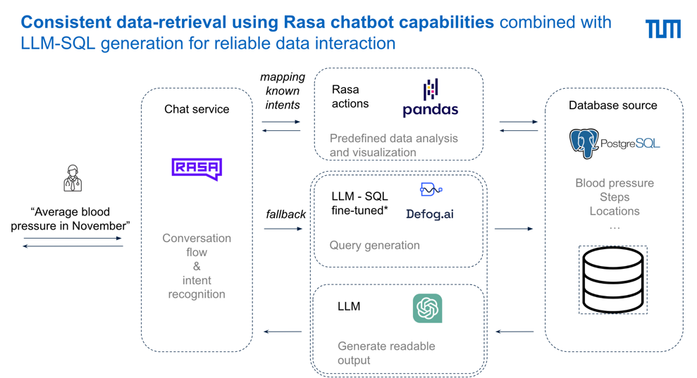

# Patient Report Insights Summary Module (PRISM) - NLP SEBA LAB 2024 @ sebis TUM

By [Julian Strietzel](mailto:julian.strietzel@tum.de), [Tim Baum](mailto:tim.baum@tum.de), [Nils Rehtanz](mailto:nils.rehtanz@tum.de), [Marc Sinner](mailto:marc.sinner@tum.de)

## Introduction

The rasa chatbot of Patient Report Insights Summary Module (PRISM) is a conversational AI chatbot that provides insights
into patient health data. The chatbot is designed to help healthcare professionals quickly and easily access important
information about their patients' health. PRISM uses natural language processing (NLP) to understand user queries and
provide relevant information in a conversational format.

To run the chatbot have a look at the [Technical guide to run the project](./documentation/README_technical.md).

Interested about the project? Have a look at
the [final presentation](documentation%2Fseba_lab_slides_prism_final_presentation_17_7_24.pptx%20%281%29.pdf) of the
project.

## Features

Have a look at the in depth features of this chatbot in
the [Documentation](./documentation/ChatBot_Expected_Intents_and_proposed_answers_2391fd98a9264f358777969412e367cd.md)
about expected intents and answers. We layed a special focus on relevant health data insights supported by graphics
within the blood pressure domain, including trend changes, daily patterns and outliers.  
Additionally, it provides several fallback handling mechanisms to ensure a smooth user experience using different LLM
techniques. Those can be triggered by out-of-scope intents or by pre-pending the user input with ask gpt or ask defog.

## Architecture

The PRISM chatbot is built using the Rasa framework, which provides tools for building conversational AI applications.
The chatbot consists of two main components: the Rasa Core, for NLU, conversation handling, and dialogue management, and
the Rasa Action Server, for custom actions and API integrations. It is used to interact with the user and provide in
depth analysis of the patient data.

## Contributors and Acknowledgements

This project was developed as part of the Natural Language Processing (NLP) SEBA pracitcal course at the Technical
University of Munich.
Within this project we were challenged to develop efficient methods to provide medical information to medical
professionals and evaluate the potential of a conversational AI chatbot in the healthcare domain. Our second
complementary approach was to use tailored LLM or rule-based approaches to provide highly focused summaries of the
patient data.

Special thanks goes to our supervisors [Phillip Schneider](mailto:phillip.schneider@tum.de)
and [Juraj Vladika](mailto:juraj.vladika@tum.de) for their guidance and support throughout the project.

Additionally we would like to thank the team of [Alma Phil](https://almaphil.de/) especially the
amazing [Lutz Frick](mailto:lutz.frick@almaphil.com) for constantly challenging us and
providing the data, aswell as the opportunity to work on this project.

