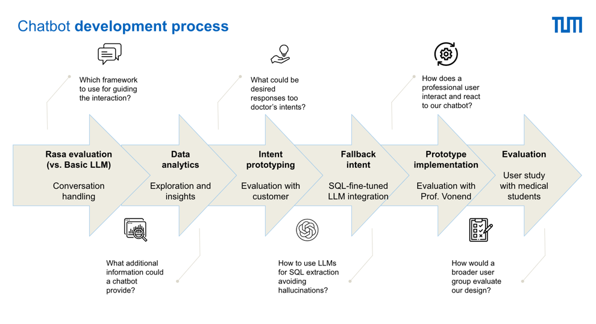
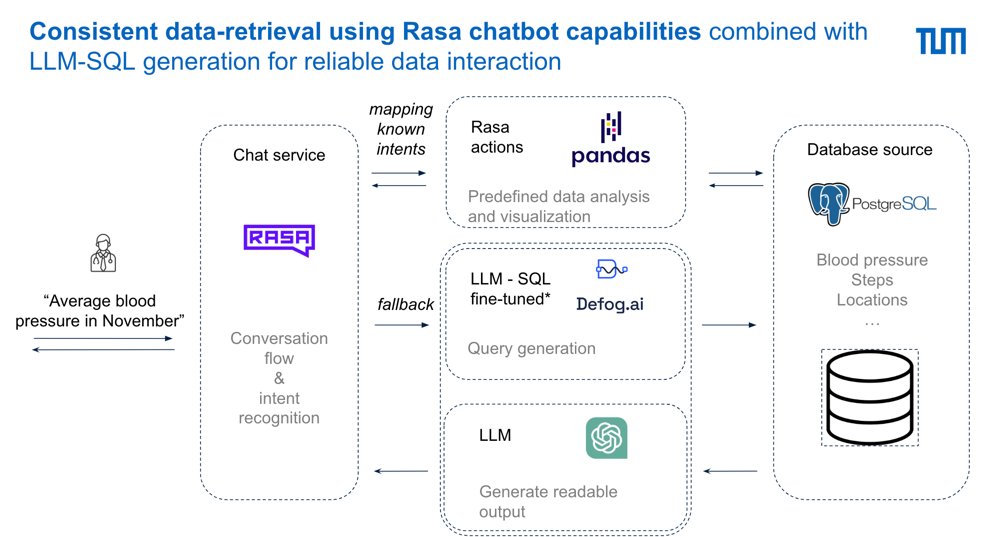
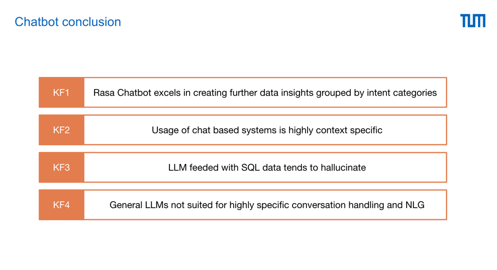

# ChatBot: Expected Intents and proposed answers

by [Julian Strietzel](mailto:julian.strietzel@tum.de)

This Document provides a comprehensive overview over the expected doctor follow up intents, that the chatbot is expected
to cvoer and will be able to answer based on the available blood pressure data.
Every other intent will be defined out-of-scope and be mapped to a LLM SQL and Text-generation pipeline.

This document should collect all intents, their potential utterances and a design proposal for the answers and
respective graphs.

This page provides exemplary original outputs of the ChatBot final version:

[Outputs of intents (German)](./ChatBot_Expected_Intents_and_proposed_answers_2391fd98a9264f358777969412e367cd/Outputs_of_intents_(German)_a6dc5d74566948eb9a033852b60a45f0.md)

This Document provides a documentation of the prototyping phase, during which we prototyped the expected answers that
were the basis of the above implementation

[Prototyping and target definition chatbot intents and answers (English)](./ChatBot_Expected_Intents_and_proposed_answers_2391fd98a9264f358777969412e367cd/Prototyping_and_target_definition_chatbot_intents_65e89ede78894a02b2dbbbbf701bcb97.md)

### Development Process:

### Architecture:

### Conclusion:

