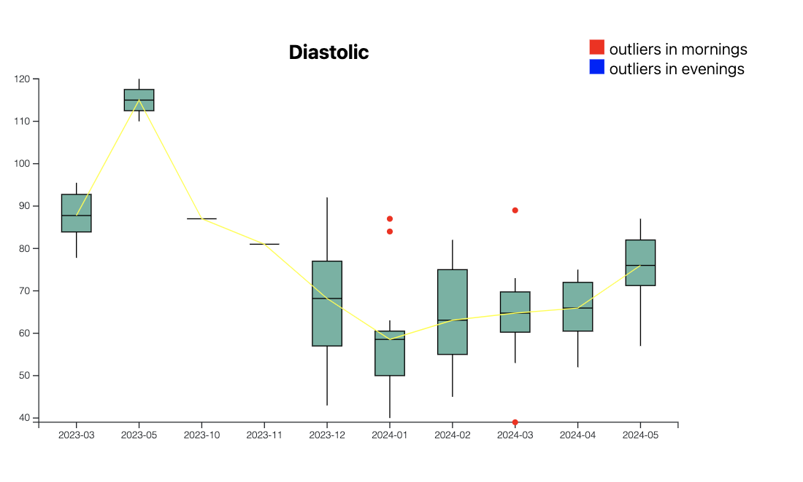

# Prototyping and target definition chatbot intents and answers (English)

Owner: Julian
Created time: June 8, 2024 3:26 PM

# General Information

### Introduction / Bot Challenge

`Are you a bot?`

`What can you do?`

`What can I do here?`

→

This ChatBot is designed to answer a range of queries related to the patient's blood pressure readings. It uses
available blood pressure data to respond to specific questions about the patient's latest readings, readings over a
certain time period, fluctuations and trends since changes in medication, and more. It can provide detailed analyses and
visualizations, aiding in a more comprehensive understanding of the patient's health.

Please continue by asking your question.

Suggested questions include:

"What were my highest and lowest readings in the past month?"

”Can you provide more details on the measurements above target range?”

"Has the user's blood pressure changed since December 12th"

### Patient Basic information

`Patient Information`

`basic details`

`Who’s the patient?`

`Whom are we talking about?`

→

The patient (female, 50 y/o) without any known preconditions has 80% of her blood pressure readings within target range.

20% of measurements are above, 0% below target range.

# Blood pressure

### Current status

`Latest BP`

`What's the latest blood pressure measurement?`

→

The most recent reading was recorded 6 days ago, 147 / 78 mmHg, Pulse: 61

This is within/out of the target corridor for a patient of the age 50.

### Current status 2

`How did the blood pressure readings behave over the last [week](timespan)?`

`How was the blood pressure since the medication change on the 25/12/2023?`

`Highest and lowest readings in the past month`

→

Blood pressure readings ranged from 110/70 mmHg to 140/90 mmHg, averaging at 125/80 mmHg.

- Within target: 70% systolic, 75% diastolic
- Below target: 20% systolic, 15% diastolic
- Above target: 10% systolic, 10% diastolic

While having a strong variation (20% above, 20% below target) in systolic blood pressure in the morning, we see slightly
raised values (20% above) in the evening.

Diastolic bp shows low levels in the morning (30% below target) and raised levels in the evening (30% above target).

### Extreme Readings

`Has the user had any readings of [systolic](type) blood pressure [higher](direction) than [130](limit) mmHg in the last [month](timespan)`

`Can you provide more details on the measurements above target range?`

`Could you highlight the readings that were above the target range?`

`Can you provide more information on the systolic blood pressure readings that exceeded the target range?`

`Were there any specific patterns or factors associated with the elevated systolic blood pressure readings?`

→

Of the 57 blood pressure measurements in the last 3 months there are 8 (15%) Systolic blood pressure readings higher
than 150 mmhg.

All of those were in the morning.

/Show graph to visualization: seaborn scatterplot from the corridor upwards grouped by daytime 2D Scale, systolic
against diastolic

Over the last weeks / Since the medication change …

### Trend changes

`Can you point out the inflection points detected in the pulse pressure trend?`

`What were the key trends and fluctuations observed in the patient's blood pressure over the last six months?`

`Can you highlight any significant trend changes in the patient's systolic blood pressure over the past year?`

`Were there any notable inflection points in the diastolic blood pressure measurements recently?`

`What changes can you identify in the pulse pressure trends over the last three months?`

`Could you point out any significant changes in the trend of the patient's pulse rate over the past month?`

`Have there been any substantial shifts in blood pressure trends since the implementation of the new medication regimen?`

→

Over the last *three months* within *systolic* blood pressure there are 3 significant inflection points.

1. We see an upward slope from 125 to 145 in systolic BP.
2. From 2nd of April we this changes to a downwards trend from 145 to 135 in systolic blood pressure.
3. From 3rd of May we see constant blood pressure at around 137 with little/high variance.

## Trend changes since medicine

`Has the user's blood pressure changed since December 12th`

`Can you provide a detailed analysis of the patient's blood pressure trends around the change of medicine?`

`What fluctuations have been observed in the patient's diastolic blood pressure readings since the medication change?`

`Could you highlight any significant changes in the patient's blood pressure since the start of their new medication regimen?`

`We changed medicine on the 15th of March what impact did that have on blood pressure measurements?`

`What patterns can been identified in the patient's pulse pressure readings over the last three months?`

`Can you provide a comparative analysis of the patient's blood pressure readings before and after the implementation of their new treatment plan?`

→

In the weeks after December 12th blood pressure readings ranged from 110/70 to 140/90 mmHg, averaging at 128/83(**↑**)
mmHg.

- Within target: 70%(**↑)** systolic, 75%(**↑)** diastolic
- Below target: 20% (**↓)** systolic, 15% (**↓)** diastolic
- Above target: 10% systolic, 10% diastolic

In the weeks before readings ranged from 110/70 mmHg to 140/90 mmHg, averaging at 125/80 mmHg.

- Within target: 60% systolic, 65% diastolic
- Below target: 30% systolic, 25% diastolic
- Above target: 10% systolic, 10% diastolic

## Trends

`Provide the blood pressure trends for the user over the last 90 days`

`What are the blood pressure e`

→

Blood pressure trends for the past three months:

In March 2024 the blood pressure readings ranged from 92/53 to 174/89 mmHg, averaging at 125/66. Pulse ranged from 60 to
67 averaging at 64 bpm.

- Within target: 70%(**↑)** systolic, 75%(**↑)** diastolic
- Below target: 20% (**↓)** systolic, 15% (**↓)** diastolic
- Above target: 10% systolic, 10% diastolic

In April 2024, the blood pressure readings ranged from 94/55 to 170/90 mmHg, with an average of 128/70. Pulse ranged
from 58 to 70, averaging at 63 bpm.

- Within target: 65%(**↓)** systolic, 70%(**↓)** diastolic
- Below target: 25%(**↑)** systolic, 20%(**↑)** diastolic
- Above target: 10% systolic, 10% diastolic

April shows an upwards trend in systolic blood pressure from 124 to 130 mmHg.

### Changes over the day

`What patterns or changes in blood pressure measurements can you identify based on the time of day?` →

In March 2024 the blood pressure readings **in the morning** ranged from 92/53 to 174/89 mmHg, averaging at 125/66.
Pulse ranged from 60 to 67 averaging at 64 bpm.

- Within target: 70%(**↑)** systolic, 75%(**↑)** diastolic
- Below target: 20% (**↓)** systolic, 15% (**↓)** diastolic
- Above target: 10% systolic, 10% diastolic

The blood pressure readings **in the evening** ranged from 92/53 to 174/89 mmHg, averaging at 125/66. Pulse ranged from
60 to 67 averaging at 64 bpm.

- Within target: 70%(**↑)** systolic, 75%(**↑)** diastolic
- Below target: 20% (**↓)** systolic, 15% (**↓)** diastolic
- Above target: 10% systolic, 10% diastolic

(If medicine change date available:) Before vs after medication on the …

`How do the patient's blood pressure readings vary throughout the day?`

`Could you highlight any significant changes or fluctuations in the patient's blood pressure based on the time of day?`

`What are the blood pressure trends during the morning, afternoon, and evening?`

`Can you provide a detailed analysis of the patient's blood pressure readings by time of day?`

`What's my blood pressure like throughout the day?`

`BP changes during the day?`

`Any noticeable blood pressure changes in the morning or evening?`

`How does my BP change from morning to night?`

`What's the day-time pattern for my blood pressure?`

`Any BP peaks or lows during the day?`

`How's my blood pressure in the morning compared to the evening`

`Does my BP fluctuate a lot during the day`

### Details on outliers BP and Pulse

`Could you highlight any outlier blood pressure readings in the last month?`

`Were there any unusual blood pressure measurements in the past week?`

`Can you identify any outlier readings in the past year?`

`Have there been any significant deviations in blood pressure readings during the last three months?`

`Could you point out any unusually high or low blood pressure readings over the past six months?` →

In the past week 50% of systolic and 30% of diastolic measurements have been extreme outliers.

All of those were in the morning. / Of those 50% (sys) and 100% (diastolic) have been in the mornings.

50% (sys) and 100% (diastolic) of the outliers have been above target range.

The number of outliers reduced significantly to 20% and 5% after medication change on the …

