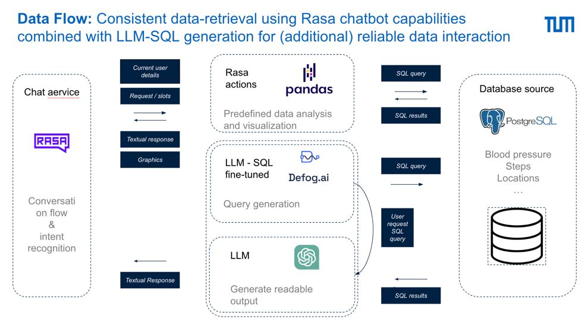

## Technical guide to run the project

### Installation

1. **use python 3.9**
2. install requirements using `pip install -r requirements.txt`
3. Provide a database "insights" according to the provided schema in the PRISM project. Potentially reconsider the
   schema to fit the needs of the project in [db_utils.py](./actions/utils/db_utils.py)
3. Set the OPENAI_API_KEY environment variable to your OpenAI API key either in your shell or in the run config.
4. initialize defog using `defog init` and use the defog api key
5.

### Testing and Development

4. Run `rasa train` to train the model
5. Run `rasa shell --debug ` to test the model locally
6. Run `rasa run actions` to run the custom actions server

### For demo purpose:

1. Run `rasa run -m models --enable-api --cors "*"` to run the rasa server instead of `rasa shell --debug`
2. Run `rasa run actions` to run the custom actions server
3. Run `cd streamlit_app` to navigate to the streamlit app and run `streamlit run app.py` to run the streamlit app
4. Open the streamlit app in the browser and interact with the chatbot
5. Potentially use ngrok to expose the rasa server to the internet

### init defog

use python 3.9
defog init -> Use defog api key
defog gen bloodpressure geo_location patient

https://docs.defog.ai/defog-python/